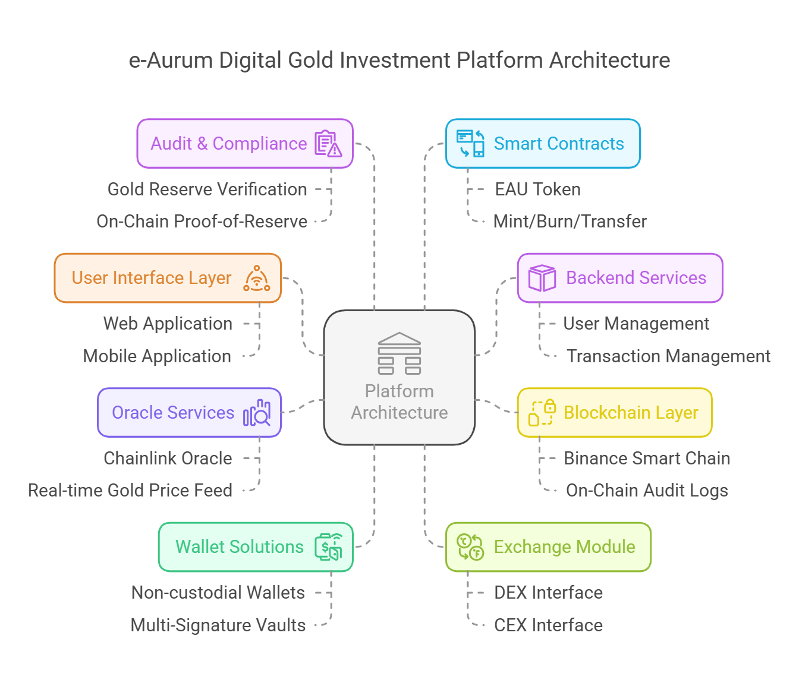

import Tabs from '@theme/Tabs';
import TabItem from '@theme/TabItem';

## High-Level System Architecture 

The e-Aurum platform is built on a modular architecture that integrates traditional financial systems with decentralized blockchain technology. This design ensures seamless operation, robust security, and scalability to meet diverse user needs. Key architectural components include: 

:::info Architecture Components
The e-Aurum platform is developed using a flexible, modular framework that bridges conventional financial infrastructure with decentralized blockchain solutions. This architecture ensures efficient performance, strong security measures, and the ability to scale to support various user demands.
:::
:::tabs

- **Frontend Interface:** A responsive web and mobile application that provides an intuitive user experience, allowing investors to buy, sell, and track digital gold tokens effortlessly. 

- **Backend Services:** Secure servers and APIs that handle user authentication, transaction processing, and integration with third-party payment gateways. 

- **Blockchain Layer:** The decentralized ledger that records all token transactions, ensuring transparency, immutability, and real-time settlement. 

- **Smart Contract Modules:** Self-executing contracts that automate critical functions such as token issuance, burning, redemption, and staking. 

- **Data Integration Layer:** Connects to external data sources, including gold price oracles and market feeds, to ensure accurate pricing and real-time valuation of tokens.

## Smart Contract Design

:::note Key Features
At the heart of e-Aurum's platform are its smart contracts, which encapsulate the logic for token management and ensure that every transaction adheres to predefined rules.
:::

- **Modularity:** Contracts are designed as modular components that can be updated independently, minimizing disruption and allowing continuous improvements. 

- **Automated Execution:** Critical processes such as token minting, burning, and redemption are fully automated, reducing the potential for human error and enhancing operational efficiency. 

- **Transparency:** Every contract is deployed on-chain, providing a public and immutable record of all operations, which builds trust and facilitates auditing. 

- **Upgradability:** Utilizing proxy patterns and multi-signature governance, smart contracts can be securely upgraded without compromising the integrity of existing transactions. 

- **Security Focus:** Rigorous testing, formal verification, and adherence to best practices ensure that the smart contracts are resistant to vulnerabilities and malicious exploits. 

## Blockchain Network Choice

:::info Network Selection
The selection of the blockchain network is pivotal for ensuring the platform's performance, security, and scalability. e-Aurum is designed to operate on a high-performance, widely adopted blockchain network.
:::

- **Network Compatibility:** e-Aurum leverages Binance networks that offer robust support for smart contracts and high throughput. 

- **Interoperability:** By choosing a blockchain with extensive developer support and integration capabilities, e-Aurum can easily interface with existing DeFi protocols and digital asset ecosystems. 

- **Scalability & Transaction Speed:** The network chosen provides high scalability and fast transaction processing times, which is critical for handling real-time token trading and redemptions. 

- **Security and Decentralization:** Emphasis on networks with proven security records and decentralized consensus mechanisms ensures that token integrity and user assets remain protected. 

## Oracles for Gold Price Feeds

Reliable price data is critical to maintaining the token’s peg to physical gold. e-Aurum employs oracle services to ensure accurate and real-time market data: 

- **Trusted Oracle Providers:** Integration with industry-leading oracle networks like Chainlink ensures that the platform receives tamper-proof, decentralized price feeds. 

- **Real-Time Data Updates:** Oracles continuously update gold price data, enabling smart contracts to perform automatic adjustments in token value and maintain parity with the physical market. 

- **Fallback Mechanisms:** Multiple oracle integrations are in place to mitigate risks of single points of failure, ensuring that price feeds remain robust even if one data source experiences issues. 

- **Transparency:** All oracle data and its usage are recorded on-chain, providing users with an auditable trail of pricing information that reinforces confidence in the token's valuation. 

## Security & Audit Mechanisms

:::warning Security Priority
Security is paramount in the design and operation of the e-Aurum platform. Comprehensive measures are implemented at every level to protect user assets and maintain system integrity.
:::

<Tabs>
  <TabItem value="multi-layer-security" label="Multi-Layer Security">
    
    Combining blockchain security features with advanced cryptographic techniques, the
    platform ensures that both digital tokens and user data remain secure.
    
  </TabItem>

  <TabItem value="wallet-security" label="Wallet Security">
    
    The use of Multi-Party Computation (MPC) and multi-signature protocols ensures
    that wallet creation, access, and transactions are safeguarded against unauthorized activities.
    
  </TabItem>

  <TabItem value="regular-audits" label="Regular Audits">
    
    Independent, third-party security audits and code reviews are conducted on all
    smart contracts and critical infrastructure components. These audits help identify
    potential vulnerabilities and ensure compliance with industry standards.
   
  </TabItem>

  <TabItem value="penetration-testing" label="Penetration Testing">
    
    Continuous penetration testing and real-world threat modeling help in preemptively
    addressing security risks.
    
  </TabItem>

  <TabItem value="disaster-recovery" label="Disaster Recovery">
    
    Robust backup and disaster recovery protocols are in place to ensure that any
    unexpected incidents are swiftly managed, minimizing downtime and data loss.
    
  </TabItem>

  <TabItem value="regulatory-compliance" label="Regulatory Compliance">
    
    Security measures are aligned with regulatory requirements, ensuring that the
    platform meets or exceeds the standards required for digital asset management and financial services.
    
  </TabItem>
</Tabs>

